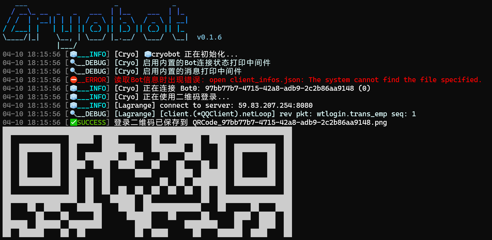

# 快速开始 <Badge type="warning" text="beta" />

在开始 Cryo 的旅程之前，你应该确认已经准备了如下事项：
- 你已经安装了 [Go](https://go.dev/dl/) 1.24+ 版本
- 你有一点 Go 语言的基础知识，或者你学过其他编程语言（e.g. Python, Kotlin, C 等）
- 如果你没有学过 Go ，我强烈建议你先去尝试一下 [Go Tour](https://tour.golang.org/) 或者 [Go Tutorial](https://go.dev/doc/) 再决定要不要继续
- 一个适合 Go 的 IDE，VSCode 是个不错的选择，但是 GoLand 更好
- 一个可以用来测试的 QQ 账号
- 一颗 动物界脊索动物门哺乳纲灵长目人科人属智人种现代智人亚种 的大脑（a.k.a. 你的脑子）

## 创建项目

和其他 Go 项目一样，你可以使用 `go mod` 来创建一个新的项目：

```bash
mkdir my-bot
cd my-bot
go mod init my-bot # 也可以标准一点，比如 github.com/yourname/my-bot
```

## 安装

```bash
go get -u github.com/machinacanis/cryo

# 作为示例，安装一个简单的回显插件，你也可以不安装
go get -u github.com/machinacanis/cryo-plugin-echo
```

::: tip
由于一些众所周知的原因，Go 语言的模块代理在国内网络环境下运行的......不是非常好，

如果你刚刚接触 Go 开发，但是在拉取依赖或者在 VSCode 拉取开发工具时出现了网络问题，你应该试试设置 Go Modules 的全局代理环境变量。
```shell
go env -w GO111MODULE=on
go env -w GOPROXY=https://goproxy.cn,direct
```
设置完成后最好重新打开当前的 Shell 会话，使用 `go env` 命令可以查看正在使用的 Go 环境变量配置。
:::

## 启动并连接

首先我们需要一个程序入口，对于 Go ，`main` 包的 `main` 函数会被视为程序入口。

对于刚才创建的空项目，我们可以创建一个 `main.go` 文件，内容如下：

```go
package main

import (
	"github.com/machinacanis/cryo"
	"github.com/machinacanis/cryo-plugin-echo"
)

func main() {
	// 创建一个新的 Bot 实例
	bot := cryo.NewBot() 
	bot.Init() // 初始化 Bot

	bot.AddPlugin(CryoPluginEcho.Instance) // 添加插件

	bot.AutoConnect() // 自动连接 NTQQ 客户端
	bot.Start() // 启动 Bot
}
```

如果你并不是从空白项目开始的，而是在将 Cryo 集成到现有项目中，你可以在任何你认为合适的地方调用 `bot := cryo.NewBot()` 和 `bot.Init()` 来初始化 Bot 实例。

现在我们可以运行或编译这个程序了：

```bash
# 直接运行
go run main.go

# 编译成二进制文件后运行
go build -o my-bot main.go
./my-bot # 对于 Windows 用户则是 ./my-bot.exe
```

第一次运行时，由于没有登录过账号，程序会自动在终端输出一个登录二维码，你需要使用扫码登录。(输出的内容不一定和这个图片完全一致一致，能看懂就OK)



扫码登录成功后，程序会自动连接 NTQQ 并将消息事件绑定到事件总线上，同时这次登录的记录会被保存，直到其失效前都可以自动登录，你也可以通过修改传入的 配置 来关闭自动保存功能。

现在我们可以正式开始 Cryo 的旅程了！